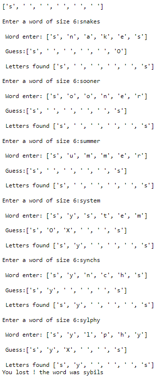

# PyLingo : Lingo game
-PyLingo is a program that allows you to play Lingo game (find the world).

# Requirement
-You will need to install the following libraries:
  -pandas
  -numpy
  -Random-Word
  -Counter
  
# How to play
- Simply launch the notebook and try to guess the word in less than 6 attempts.

# How it work
- A random number N between 5 and 10 is chosen.
- This number N will allow the Random-Word library to choose a word with N letters.
- The word will be stored in a list letter by letter.
- The quantity of each letter will be counted.
- The user will enter a word with N letters.
- The program will look at whether or not the letters are in the right places.
- The analysis is stored in a variable that will display if the letters are present in the word and if they are in the right places
- If the variable made by the analysis contains all the letters in the right places, then the user has found the word and it is won!

# Screen of the game launched
- Win screenshot

- Lose screenshot

